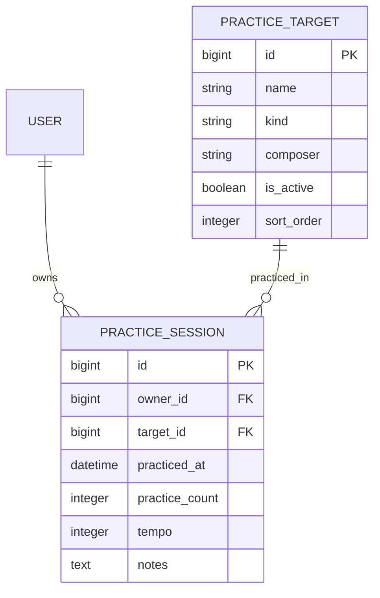

# アプリケーション設計

## 1. MVP

### 目的

楽器を練習する人が「何を何回練習し、どのような手応えだったか」を簡単に記録し、
次回の練習へつなげられるようにする。最初のリリースでは練習回数の登録と履歴確認に
集中し、DB、API、画面、fixture、デプロイまでを1本の縦切り機能として成立させる。

### 対象ユーザー

- 個人でピアノなどの楽器を練習する学習者。
- 認証とユーザー別データ分離を実装するまでは、LocalおよびStagingを開発者1人による
  動作確認に限定する。

### MVPで提供する価値

- 曲、練習曲、基礎練習から、その日の練習対象を選べる。
- 反復した回数を1以上の整数で記録できる。
- 必要に応じてテンポと振り返りメモを残せる。
- 最近の練習履歴を新しい順に確認できる。

### 完了条件

- 有効な練習対象が一定の順序で表示される。
- 練習対象と1以上の練習回数を指定して記録できる。
- 同じ練習対象について複数の記録を追加できる。
- テンポは未入力、または1以上の整数である。
- Staging DBをmigrationと非機密fixtureから再生成できる。

### MVPの対象外

- ユーザー登録、ログイン、共有、複数ユーザー運用。
- タイマーによる練習時間の計測。
- 音声・動画の保存、自動採点、演奏分析。
- 練習目標、統計、通知、バックグラウンド処理。
- WebSocketによるリアルタイム連携、オフライン利用、ネイティブアプリ。

認証は次の開発単位とする。ただし後から所有関係を追加してmigrationを壊さないよう、
`PracticeSession.owner`は最初からnullableな項目として保持する。

## 2. ユースケース

### UC-01: 練習回数を登録する

**事前条件:** 有効な練習対象が1件以上ある。

1. ユーザーがダッシュボードを開く。
2. 練習対象を選択する。
3. 練習した回数を入力する。
4. 必要ならテンポと振り返りメモを入力する。
5. 「Record practice」を押す。
6. システムが登録日時を付与し、記録を履歴へ追加する。

**例外:** 対象が無効、練習回数またはテンポが不正、APIへ接続できない場合は、
登録せず画面にエラーを表示する。

### UC-02: 最近の練習履歴を確認する

1. ユーザーがダッシュボードを開く。
2. システムが直近50件までの記録を新しい順で取得する。
3. 練習対象、登録日、練習回数、テンポ、メモを表示する。

## 3. ドメインモデル



### PracticeTarget（練習対象）

| 項目 | 必須 | 説明 |
| --- | --- | --- |
| `name` | はい | 表示名。最大200文字 |
| `kind` | はい | `piece`、`exercise`、`technique`のいずれか |
| `composer` | いいえ | 作曲者・著者。最大200文字 |
| `is_active` | はい | 一覧で選択可能かどうか |
| `sort_order` | はい | 一覧の表示順 |

### PracticeSession（練習記録）

| 項目 | 必須 | 説明 |
| --- | --- | --- |
| `owner` | いいえ | 将来の認証ユーザー。MVPでは未設定 |
| `target` | はい | 練習対象。履歴保護のため削除時は`PROTECT` |
| `practiced_at` | はい | サーバーが設定する登録日時 |
| `practice_count` | はい | 練習した回数。1以上の整数 |
| `tempo` | いいえ | 練習時のBPM。1以上の整数 |
| `notes` | いいえ | 振り返り。最大2,000文字 |

開始時刻、終了時刻、算出した練習時間は保持しない。MVPの`PracticeSession`は実行中の
状態を表すセッションではなく、完了した練習を1回登録した記録を表す。

## 4. API

すべてJSONを使用し、日時はタイムゾーン付きISO 8601形式で返す。MVPでは認証を要求しない。

| Method | Path | 用途 | 主な成功応答 |
| --- | --- | --- | --- |
| `GET` | `/api/practice-targets/` | 有効な練習対象の一覧 | `200` |
| `GET` | `/api/practice-sessions/` | 直近50件の練習記録 | `200` |
| `POST` | `/api/practice-sessions/` | 練習回数を登録 | `201` |
| `GET` | `/api/health/` | APIとDBのreadiness確認 | `200` |

### 練習回数の登録

```http
POST /api/practice-sessions/
Content-Type: application/json

{
  "target": 1,
  "practice_count": 5,
  "tempo": 72,
  "notes": "左手のリズムが安定した"
}
```

応答には練習対象の表示情報を持つ`target_detail`と、サーバーが設定した`practiced_at`を
含める。入力不正は`400`を返す。

## 5. 画面

MVPではダッシュボード1画面に登録フォームと履歴を集約する。

```text
┌──────────────────────────────────────────────┐
│ Instrument Practice                          │
│ Make every repetition count.                 │
├──────────────────────────────────────────────┤
│ 練習対象                                     │
│ 練習回数（必須）                             │
│ テンポ・メモ（任意）                         │
│ [Record practice]                            │
├──────────────────────────────────────────────┤
│ Practice history                             │
│ 対象 | 登録日 | 練習回数 | テンポ | メモ     │
└──────────────────────────────────────────────┘
```

| 状態 | 表示・操作 |
| --- | --- |
| 初期読込 | Next.jsサーバーが練習対象と練習記録を並行取得する |
| 入力 | 対象、回数、テンポ、メモを入力できる |
| 送信 | 通常のHTMLフォームでNext.js Route Handlerへ送信する |
| 登録成功 | ダッシュボードへ戻り、成功通知と最新の履歴を表示する |
| エラー | フォーム上部へ`role="alert"`のメッセージを表示する |
| 履歴なし | 登録すると履歴に表示される旨を表示する |

幅700px以下では入力カードと履歴を1列へ変更する。キーボード操作、labelと入力の関連、
フォーカス表示を維持する。

## 6. インフラとの接点

| 接点 | Local | Staging | アプリ側の前提 |
| --- | --- | --- | --- |
| HTTP routing | Next.jsサーバーが内部URLでDjangoへ接続 | ALBがFrontendへ、内部通信がBackendへ到達 | ブラウザはFrontendのRoute Handlerへ送信 |
| Frontend | Next.js development server | ECS/Fargate Frontend service | `BACKEND_INTERNAL_URL`と`FRONTEND_PUBLIC_URL`を環境変数で指定 |
| Backend | Django development server | ECS/Fargate Backend service | DB接続情報とSecretを環境変数から取得 |
| Database | Docker Compose PostgreSQL | 使い捨てRDS PostgreSQL | migrationがschemaの正、fixtureが初期データの正 |
| 初期化 | `migrate`、`loaddata` | One-off ECS taskで順次実行 | 成功後にserviceへtrafficを流す |
| Health check | `/api/health/` | Backend target groupから確認 | DjangoとDBのreadinessを返す |
| Log | 標準出力 | CloudWatch Logs | Secretや個人情報を出力しない |

認証、ユーザーごとのデータ分離、S3、Queue/Worker、WebSocketは、それらを必要とする
ユースケースを実装するときにインフラ設計と同時に追加する。

## 7. 対応関係と次の開発単位

| ユースケース | API | 画面 | 主なデータ |
| --- | --- | --- | --- |
| UC-01 回数登録 | `POST /api/practice-sessions/` | 登録フォーム | `target`、`practice_count`、`tempo`、`notes` |
| UC-02 履歴確認 | `GET /api/practice-sessions/` | 履歴一覧 | `practiced_at`を含む`PracticeSession` |

次は認証とユーザーごとのデータ分離を実装する。その後、練習対象管理、目標・統計、
メディア・自動分析の順に、短命な機能ブランチで縦切りに追加する。
