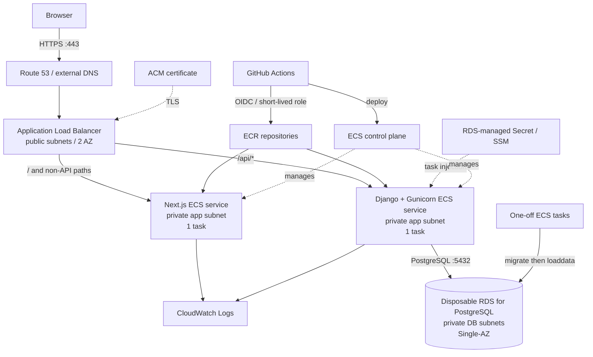
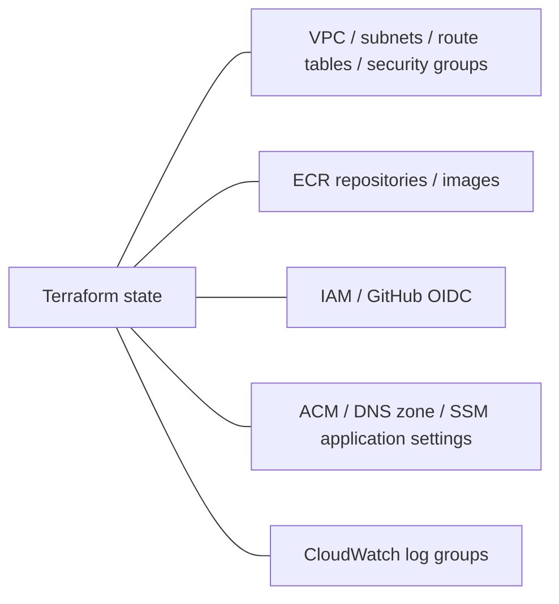

# AWS deployment architecture

## 1. 目的と対象環境

`Piano practice app` を AWS 上へ安全にデプロイし、VPC、ロードバランサー、
コンテナ、マネージド PostgreSQL、IAM、監視、CI/CD を実践的に学ぶための設計である。
最初の対象は `staging` のみとし、`production` はステージングで運用手順と費用を
確認した後に別途設計する。

ステージングは毎日使用しないため、常時稼働させない。ネットワーク定義やコンテナ
repositoryなどの安価な基盤だけを保持し、課金の大きい実行系リソースは開発作業の開始時に
Terraformで作成し、終了時に削除する。DBデータは永続化せず、migrationとfixtureから毎回
再生成する。

この文書は設計レビュー用であり、AWSリソースはまだ作成しない。Terraform applyの前に
費用とplanを提示し、Terraform destroyの前には対象を確認して明示的な承認を得る。

### 環境の位置づけ

| 環境 | 場所 | 用途 | 稼働方針 |
| --- | --- | --- | --- |
| Local | 開発PC上のDocker Compose | 日常の実装、単体確認 | 必要時のみ |
| Staging | AWS | AWS構築、デプロイ、HTTPS、監視、復旧の検証 | 作業時だけ作成 |
| Production | AWS | 将来の実ユーザー向け公開 | 今回は作成しない |

### 設計原則

- リージョンは `ap-northeast-1`（東京）、ネットワークは2 Availability Zone (AZ) とする。
- インターネットから直接到達できるアプリケーションリソースはALBのみとする。
- ECS taskとRDSはprivate subnetに置き、public IPを付与しない。
- StagingはSingle-AZ RDS、サービスごとにECS task 1個、NAT Gateway 1台とする。
- 課金の大きいALB、NAT Gateway、ECS task、RDSは作業終了時に削除する。
- StagingのDBを状態保存先として扱わず、再現可能なfixtureを正とする。
- Secret、Terraform state、AWS認証情報をGitに保存しない。
- GitHub ActionsのAWS認証には、有効期限のあるOIDC sessionを使用する。
- すべてのリソースへ `Project=instrument-practice-app`、`Environment=staging`、
  `ManagedBy=terraform` のtagを付ける。

## 2. アーキテクチャ

### 作業時の構成



ALBは2 AZのpublic subnetに関連付ける。FrontendとBackendは同じALBを共有し、
`/api/*`をBackend、それ以外をFrontendへ送る。この構成はCORSを単純化し、ALBの料金が
二重になることを避ける。

### 停止時に残る構成



停止時にはNAT Gateway、ALB、ECS service/task、target group、RDSを残さない。VPC、subnet、
Security Groupなど、それ自体に通常の時間料金がない定義は保持する。ECR image、DNS hosted
zone、Secret、log保存などには少額の料金が残る可能性がある。

## 3. Terraformの境界とライフサイクル

誤って常設基盤まで削除しないよう、stateとroot moduleを2つに分離する。細かなservice単位の
過剰なmodule化はせず、「寿命が違うもの」を境界にする。

```text
infrastructure/
├── README.md
├── modules/
│   ├── network/
│   ├── security-groups/
│   ├── ecr/
│   ├── iam/
│   ├── alb/
│   ├── ecs/
│   ├── rds/
│   └── monitoring/
└── environments/
    └── staging/
        ├── foundation/        # 通常は一度だけapply
        │   ├── main.tf
        │   ├── providers.tf
        │   ├── variables.tf
        │   └── outputs.tf
        └── runtime/           # 作業ごとにapply/destroy
            ├── main.tf
            ├── providers.tf
            ├── variables.tf
            └── outputs.tf
```

| State | 管理対象 | 操作頻度 |
| --- | --- | --- |
| `staging-foundation` | VPC、subnet、route table、Security Group、ECR、IAM、OIDC、ACM、DNS、log group、設定保存先 | 初回と設定変更時 |
| `staging-runtime` | NAT Gateway/EIP、ALB/listener/target group、ECS service/task definition、RDSとRDS管理Secret | 作業の開始・終了ごと |

初期学習ではlocal stateを許容するが、stateはGitへ追加しない。継続運用前にversioningと暗号化を
有効にしたS3 backendおよびstate lockingへ移行する。Runtimeはfoundationのoutputをremote
state経由で参照する。循環参照は作らない。

`terraform destroy`へ `-target` は使用しない。Runtime root全体をplanして削除する。
Foundationのdestroyは通常手順に含めず、別コマンド、別state、別承認にする。

## 4. 採用するAWSサービス

| サービス | 用途 | ライフサイクル |
| --- | --- | --- |
| VPC/Subnet/Route Table | ネットワーク分離 | 常設foundation |
| Internet Gateway | ALBとNAT Gatewayの外向き通信 | 常設foundation |
| NAT Gateway/EIP | Private app subnetからECR等への外向き通信 | 作業時runtime |
| ECS on Fargate | Next.jsとDjangoのコンテナ実行 | 作業時runtime |
| ECR | Frontend/Backend image保存 | 常設foundation |
| ALB | TLS終端とpath routing | 作業時runtime |
| RDS for PostgreSQL | 使い捨てのStaging DB | 作業時runtime |
| ACM | HTTPSに必要なTLS証明書 | 常設foundation。Start前に状態と有効期限を確認 |
| Route 53または既存DNS | 固定名から作り直したALBへの名前解決 | Hosted zoneはfoundation、recordはruntime |
| Secrets Manager / SSM | RDS管理のDB認証情報とアプリ設定 | DB認証情報はruntime、SSM設定はfoundation |
| CloudWatch | Log group、metrics、alarm | Log groupはfoundation、runtime依存alarmはruntime |
| IAM | Task role、execution role、CI/CD role | 常設foundation |
| AWS Budgets | 費用通知 | AWS account基盤として常設 |

ECS、ECR、IAM、Route 53などのAWS管理control planeは利用者が停止・作成する対象ではない。
課金と削除の対象はrepository、task、load balancer、DB instanceなど、Terraformで管理する個別
resourceである。

### ACM証明書の役割と更新

ACM（AWS Certificate Manager）は、WebサイトをHTTPSで公開するためのTLS証明書を管理する
サービスである。証明書は通信を暗号化し、ブラウザが正しいドメインへ接続していることを確認する
ために使われる。今回の構成では、ブラウザからHTTPS通信を受けるALBへACM証明書を設定する。

```text
Browser -- HTTPS --> ALB -- HTTP --> Frontend / Backend
                       ^
                       |
                 ACM certificate
```

証明書には有効期限がある。ACM発行証明書は通常、ALBなど対応するAWSサービスで使用中かつ
DNS検証条件を満たしていれば自動更新される。しかし、このStagingでは停止時にALBを削除する。
ALBが長期間存在しないと証明書が自動更新の対象外となり、次回Startまでに期限切れになる可能性が
ある。詳細は[AWS Certificate Managerのマネージド更新](https://docs.aws.amazon.com/acm/latest/userguide/managed-renewal.html)
を参照する。

ACM証明書とDNS検証用CNAME recordはFoundationとして保持する。Startの最初に証明書の状態、
有効期限、DNS検証recordを確認し、`ISSUED`かつ有効期限が14日以上残っている場合だけRuntimeの
作成へ進む。期限切れ、発行失敗、または残存期間14日未満の場合は、FoundationのTerraformで
証明書を明示的に再発行し、DNS検証が完了してからALBを作成する。

```text
Check ACM certificate
  -> ISSUED and valid for 14 days or more: continue Runtime apply
  -> otherwise: replace certificate in Foundation
                -> wait for DNS validation
                -> continue Runtime apply
```

証明書をRuntimeごとに発行・削除すると、Start時間と発行失敗の機会が増えるため採用しない。
有効期限接近を見落とさないよう、ACMの期限接近EventBridge eventをSNSへ通知する構成をFoundationへ
追加する。

## 5. ネットワークとSecurity Group

### CIDR案

| AZ | Public | Private app | Private DB |
| --- | --- | --- | --- |
| `ap-northeast-1a` | `10.20.0.0/24` | `10.20.10.0/24` | `10.20.20.0/24` |
| `ap-northeast-1c` | `10.20.1.0/24` | `10.20.11.0/24` | `10.20.21.0/24` |

VPC CIDRは `10.20.0.0/16` とする暫定案である。Terraform apply前に既存VPC、VPN、社内
networkとの重複を確認して確定する。Public route tableは `0.0.0.0/0` をInternet Gatewayへ
向ける。Runtime作成時だけ、private app route tableの `0.0.0.0/0` を1aのNAT Gatewayへ
向ける。Private DB route tableにInternet向けdefault routeは設けない。

NAT Gateway 1台は費用優先のStaging構成である。1cのECS taskから外部へ出る通信はAZを
またぎ、NAT障害または1a障害時にはimage pullや外部API通信が失敗し得る。本番ではAZごとに
NAT Gatewayを配置するか、必要なVPC endpointとIPv6 egressを組み合わせて再設計する。

### Security Group

Security Group間の参照を使い、CIDRによる広い許可を避ける。

| Security Group | Inbound | Outbound |
| --- | --- | --- |
| `alb` | InternetからTCP 443。TCP 80はHTTPS redirectのみに使用 | `frontend`のTCP 3000、`backend`のTCP 8000 |
| `frontend` | `alb`からTCP 3000のみ | HTTPS 443。Backend呼出方式確定後に必要な通信を追加 |
| `backend` | `alb`からTCP 8000のみ | `database`のTCP 5432、AWS API/外部依存向けHTTPS 443 |
| `database` | `backend`およびmigration taskからTCP 5432のみ | 原則default outboundを削除 |

ECS Execを有効化する場合もinbound portは開けない。SSM Messages等への到達手段と、操作
担当者だけが使用できるIAM権限、CloudTrailによる監査を用意する。

### ALBとhealth check

- Backend target group: `GET /api/health/`、成功code `200`。
- Frontend target group: 専用の軽量な `GET /health` を追加して使用する。
- ALBはHTTPからHTTPSへredirectし、TLS 1.2以上のsecurity policyを使う。
- Route 53 Alias recordはRuntime apply時に新しいALBへ向け、destroy時に削除する。
- Django管理画面を公開する場合、強固な認証に加えてWAF、VPN、IP allowlist等を検討する。
- Django health checkはDB接続も確認する。一時的なDB遅延で全Backend taskが外されないよう
  timeoutとthresholdを調整する。

## 6. DB初期化とfixture

Staging DBは使い捨てとし、snapshot、停止状態のDB、手作業で作ったデータへ依存しない。
Runtime applyごとに空のRDS instanceを作成し、次の順序で初期化する。

```text
RDS available
  -> one-off Backend task: python manage.py migrate --noinput
  -> one-off Backend task: python manage.py loaddata staging_seed
  -> Backend/Frontend service desired countを1へ変更
  -> health checkとfixture内容を確認
```

Fixtureはreview可能な非機密のテストデータとしてrepositoryへ保存する。個人情報、本番データ、
実在するメールアドレス、共通password、API keyを含めない。ユーザー認証データが必要なら、
fixtureへpassword hashを固定保存するのではなく、管理commandで環境変数から一時passwordを
設定する方法も検討する。

Migrationとfixture投入はservice containerの起動commandへ含めない。同時起動による重複実行を
避け、失敗を検知できるone-off ECS taskとして実行する。Fixture投入処理は複数回実行しても
予測可能な結果になるよう設計し、失敗時にはserviceを起動しない。

Stagingで手入力したデータは作業終了時に失われることを前提とする。永続化が必要になった時点で、
fixtureの更新、snapshot、または常設DBのどれを採用するか改めてレビューする。

## 7. Secretと設定管理

| 値 | 保存先案 | ライフサイクル |
| --- | --- | --- |
| RDS master credentials | RDSがSecrets Managerで自動管理 | RDSと同じRuntime lifecycle。RDS削除時に関連Secretも削除 |
| `DJANGO_SECRET_KEY` | SSM Parameter Store SecureString | Foundationとして保持、Staging専用 |
| Fixture用一時password | 手動入力または短命なSecureString | 投入後に削除・rotation |
| host、port、DB名、log level | ECS environmentまたはSSM Parameter Store String | Secretではない設定 |
| GitHub/AWS federation | GitHub OIDC | 長期access keyを不要にする |

RDSはmaster passwordをTerraformで指定せず、`manage_master_user_password=true` により生成と
Secrets Managerへの保存をRDSへ委ねる。これによりpassword自体をTerraform stateへ保存せず、
固定名のuser-managed Secretが削除後のrecovery windowに残って次回Startを妨げる問題を避ける。
RDSが管理するSecretはDB instanceの削除時に関連metadataとともに削除され、次回は新しいRDSと
Secretが作成される。詳細は
[RDSとSecrets Managerによるpassword管理](https://docs.aws.amazon.com/AmazonRDS/latest/UserGuide/rds-secrets-manager.html)
を参照する。

Migration task、fixture task、初期のStaging Backendは、このRDS管理Secretを参照する。Production
ではmaster userを通常のapplication処理に使わず、最小権限のapplication用DB userとcredential
rotationを別途設計する。

それでもTerraform stateには機密性のある設定やresource metadataが含まれ得るため、stateを暗号化、
アクセス制御、履歴管理する。Terraform outputに `sensitive=true` を付けてもstateから値が消える
わけではない。

ECS task definitionの `secrets` でtask起動時に値を注入する。Execution roleには対象parameter/
secretの読取権限だけを与え、application task roleと分離する。`NEXT_PUBLIC_*`にはSecretを
格納しない。

## 8. 起動・停止手順

### 初回のみ

1. AWS作業identity、MFA、Budget通知を確認する。
2. Foundationの `terraform plan` と費用をレビューする。
3. 明示承認後、Foundationをapplyする。
4. Production imageをbuildし、commit SHA tagでECRへpushする。

### 作業開始（start）

1. ACM証明書が `ISSUED` で、有効期限が14日以上残り、DNS検証recordが存在することを確認する。
2. 条件を満たさない場合はFoundationで証明書を再発行し、DNS検証完了を待つ。
3. Runtimeの変数、対象image tag、作業者identityを確認する。
4. Runtime planを保存し、作成される課金resourceと概算を確認する。
5. 明示承認後、RDS、NAT Gateway、ALB、ECS serviceをdesired count 0でapplyする。
6. RDSがavailableになったら、migration taskとfixture taskを順に実行する。
7. 両方成功した場合だけECS desired countを1にする。
8. Frontend、`/api/health/`、HTTPS、logを確認する。

### 作業終了（stop）

1. 必要な変更がcode、migration、fixtureへ反映済みであることを確認する。
2. ECS desired countを0にし、ALB connection drainingとtask停止を待つ。
3. Runtimeのdestroy planを作成し、NAT Gateway、ALB、ECS、RDSなど対象を列挙する。
4. DBデータが消えることを含め、ユーザーの明示承認を得る。
5. Runtime rootに対して `terraform destroy` を実行する。RDS管理SecretもRDSとともに削除される。
6. AWS Resource Explorer、tag検索、Cost Explorer等で課金resourceの残存を確認する。
7. 固定名のuser-managed DB Secretが削除待ちで残っていないことを確認する。
8. FoundationのVPC、ECR、IAM、ACM、DNS検証record、必要なlog groupが残っていることを確認する。

開始・停止はPowerShell scriptまたはGitHub Actionsのmanual workflowへまとめる。ただし、destroyの
承認を省略せず、対象account、region、workspace、planを画面に表示する。異常終了時にも課金resource
を検出できるcleanup checklistを `infrastructure/README.md` に置く。

## 9. CI/CD

```text
Pull Request
  -> existing Frontend / Backend CI
  -> terraform fmt/validate and read-only plan（IaC導入後）
  -> review and squash merge
main
  -> build immutable Frontend/Backend images
  -> scan images
  -> push commit-SHA tags to ECR
Manual staging start
  -> runtime apply with services at zero
  -> migration and fixture tasks
  -> services to desired count 1
  -> verify health endpoints
Manual staging stop
  -> services to zero
  -> reviewed runtime destroy
```

`latest` tagだけに依存せず、Git commit SHAでimageを特定できるようにする。GitHub OIDC trust
policyはrepository `hiroko-yamada-466997/instrument-practice-app` と許可するbranch/environmentに
限定し、`aud`を `sts.amazonaws.com` に限定する。

PRのplan role、mainのimage push role、Stagingのapply/destroy roleは分ける。特にdestroyを
実行できるroleはGitHub Environmentの承認規則で保護する。長期AWS access keyはGitHub Secretsへ
保存しない。

## 10. ログ、監視、費用管理

### ログとアラーム

- Frontend/Backendのstdout/stderrを別々のCloudWatch Log Groupへ送り、保持期間は14日とする。
- Django request IDとALB trace IDを関連付けられる形式にする。
- 個人情報やSecretをlogへ出力しない。
- 作業時はALB 5xx、unhealthy host、ECS task不足、CPU/Memory、RDS storage/connectionsを監視する。
- Runtime destroy後に不要になるalarmはRuntimeと一緒に削除する。
- 起動失敗、fixture失敗、destroy失敗はSNS等で通知する。

### 費用見積もり

前提は東京リージョン、低traffic、Frontend/Backend各0.25 vCPU・0.5 GiB、Single-AZの小型
RDS、NAT Gateway 1台、ALB 1台である。税、無料利用枠/credit、為替、internet transfer、
cross-AZ transferは含めない。

| 区分 | 主な項目 | 課金の考え方 |
| --- | --- | --- |
| Foundation | ECR image、Route 53 hosted zone/query、Secrets、CloudWatch log保存 | 停止中も少額が残る |
| Runtime | NAT Gateway/EIP、ALB/LCU/public IPv4、Fargate、RDS、log取込 | 作成からdestroy完了まで時間・使用量課金 |
| Variable | Internet/AZ間data transfer、NAT処理量、snapshot | 使用量に依存 |

常時稼働案の月額111–179 USDは採用しない。月20時間程度の作業で毎回確実にRuntimeを削除する
場合、低trafficなら全体で概ね月5–20 USDを初期目安とする。ただし、resource作成の待ち時間、
部分時間の切り上げ、通信量、残存resourceにより増える。Terraform実装後、AWS Pricing Calculator
へ実際のresourceと利用時間を入力して再見積もりする。

AWS Budgetsは最初の課金resourceより先に、月額cost budgetを `20 USD` として作成する。
通知はactual costに対して次の3段階とし、すべて同じ運用担当メールアドレスへ送る。

| Actual cost | Budget比率 | 対応 |
| ---: | ---: | --- |
| `5 USD` | 25% | 早期警告。利用中のRuntimeとCost Explorerを確認する |
| `10 USD` | 50% | 残存resourceと当月の利用予定を確認する |
| `20 USD` | 100% | 緊急警告。作業中でなければRuntimeのdestroyを実施する |

初期構成ではforecast通知とBudget Actionsによる自動制御を設定しない。Budgetの請求データと
通知には遅延があり、20 USD到達時に課金が停止するわけではない。既存のALB、NAT Gateway、
ECS、RDSも自動削除されないため、stop手順と翌日の残存resource確認を必須にする。

料金体系の確認先:

- [AWS Fargate Pricing](https://aws.amazon.com/fargate/pricing/)
- [Elastic Load Balancing Pricing](https://aws.amazon.com/elasticloadbalancing/pricing/)
- [Amazon VPC Pricing](https://aws.amazon.com/vpc/pricing/)
- [Amazon RDS for PostgreSQL Pricing](https://aws.amazon.com/rds/postgresql/pricing/)
- [Amazon CloudWatch Pricing](https://aws.amazon.com/cloudwatch/pricing/)
- [AWS Secrets Manager Pricing](https://aws.amazon.com/secrets-manager/pricing/)
- [AWS Pricing Calculator](https://calculator.aws/)

## 11. バックアップと復旧

Staging DBはfixtureから再生成するため、automated backup、manual snapshot、final snapshot、
deletion protectionを初期構成では使用しない。Runtime RDSは `skip_final_snapshot=true` とし、
destroyでデータを削除できる設定にする。この設定はStagingだけに限定し、Productionへ流用しない。

Stagingの復旧元は次の3つである。

1. Gitで管理されたapplication code、migration、fixture。
2. ECRのcommit SHA付きFrontend/Backend image。
3. Terraform codeとstateから再作成できるAWS構成。

復旧演習ではRuntimeをdestroyし、空の状態からstart手順を実行して、Frontend表示、DB接続、
fixture内容、HTTPS、logを確認する。目標はデータ復元ではなく、環境全体を再生成できることの
確認である。

Productionではこの方針を採用しない。Business要件からRPO/RTOを決め、Multi-AZ、automated
backup、point-in-time recovery、deletion protection、final snapshot、復元演習を別途設計する。

## 12. 障害時の考え方

| 障害 | Stagingでの挙動 | 対応・将来改善 |
| --- | --- | --- |
| ECS task/process障害 | ECSがtaskを再作成。1 taskのため一時停止し得る | Imageとlogを確認し、必要なら再apply |
| 1 AZ障害 | Task、Single-AZ RDS、単一NATの配置次第で停止 | Stagingは復旧待ちまたは再作成。本番はMulti-AZ |
| RDS障害 | API停止 | Runtimeを再作成しmigration/fixtureを再実行 |
| 不良image | Deploymentが失敗 | 既知のcommit SHA imageへ戻す |
| Migration/fixture失敗 | Serviceをdesired count 0のまま維持 | One-off task logを修正し、空DBから再実行 |
| Start途中の失敗 | 一部課金resourceが残る可能性 | Destroy planを確認してRuntimeをcleanup |
| Destroy失敗 | 課金resourceが残る可能性 | StateとAWS実体を照合し、再destroyまたはimportして解消 |
| Terraform操作ミス | 置換や削除が発生し得る | State分離、plan review、account/region表示、Foundation別承認 |
| リージョン障害 | Staging停止 | 復旧後に再作成。本番のmulti-regionは要件次第 |

Stagingは高可用性を保証する環境ではない。障害を検出し、codeから再作成する手順を学ぶ環境と
位置づける。

## 13. 採用しなかった案

- **ECSだけdesired countを0にする**: ALB、NAT Gateway、RDSの料金が残るため不十分。
- **RDSを停止して保持する**: Storage料金が残り、停止から7日後に自動起動する。毎日使わない
  Stagingにはfixture再生成の方が単純。
- **RDS snapshotを毎回保存する**: 現時点では保持すべきデータがなく、保存料金と復元手順が増える。
- **平日などの固定scheduleで起動する**: 利用日が不定期なため、manual start/stopの方が無駄が少ない。
- **Amazon EKS**: Kubernetes運用の学習範囲と固定費が増え、現在の小規模applicationには過剰。
- **EC2上のDocker Compose**: 安価にできるが、managed container orchestration、task role、rolling
  deploymentの学習目的を満たしにくい。
- **Elastic Beanstalk / App Runner / Lightsail**: 公開は容易だが、VPC/ALB/ECSの関係を明示的に
  設計する目的と合わない。費用優先案としては再検討可能。
- **Lambda + API Gateway**: Django/Next.jsの常駐container構成からの変更が大きい。
- **Aurora PostgreSQL**: 現段階の負荷に対して複雑性と費用が高い。
- **RDS Multi-AZ、ECS各2 tasks、NAT 2台**: Production候補だが、Stagingでは費用を優先する。
- **Frontend/Backend ALBの分離**: 障害domainは分けやすいが、固定費とDNS/CORS管理が増える。

## 14. 実装前の決定事項

未決のまま有料resourceを作成しない。

| # | 決定事項 | 推奨初期値 |
| --- | --- | --- |
| 1 | AWS account、root MFA、作業identity | root MFA有効、root access keyなし、IAM Identity Centerを使用 |
| 2 | 月額上限とBudget通知 | **決定済み:** 月額20 USD、actual cost `$5/$10/$20`でメール通知、自動アクションなし。通知先アドレスは設定時に入力 |
| 3 | Stagingの稼働方針 | Manual start/stop、作業終了時にRuntimeを完全削除 |
| 4 | DBデータ | Git管理のfixtureから毎回生成し、作業終了時に破棄 |
| 5 | Domain/DNS | 所有domainのsubdomainを使用。未所有なら購入費を別計上 |
| 6 | PostgreSQL version | Application互換性とRDS提供状況を実装時に確認して固定 |
| 7 | Terraform state | Foundation/Runtimeを分離。初期local、継続前にS3 + lockingへ移行 |
| 8 | Frontend/Backend公開 | 同一ALBのpath routing |
| 9 | Static assets | Next.jsは自身から配信。Django admin staticはWhiteNoiseまたはS3を選択 |
| 10 | ECS CPU/Memoryとarchitecture | 各0.25 vCPU/0.5 GiB、可能ならARM64。実測で変更 |
| 11 | Secret store | RDS資格情報はRDS管理Secret、その他はSSMを基本とする |
| 12 | Start/stopの実行場所 | 初期はlocal PowerShell、安定後に承認付きmanual workflowを検討 |

## 15. 実装前チェックポイント

1. AWS identityとMFAを確認し、Budgetsを設定する。
2. Fixtureの作成方針と、DBを毎回破棄することをレビューする。
3. Production Dockerfile、Gunicorn、Django proxy/CSRF/static設定、Frontend health endpointを実装する。
4. TerraformのFoundation/Runtime境界、provider version、PostgreSQL versionを確定する。
5. AWS Pricing Calculatorで利用時間を含む見積もりを作る。
6. Foundation planとRuntime planを別々に提示する。
7. 明示承認後にFoundation、続いてRuntimeをapplyする。
8. Migration、fixture、health、HTTPS、log、image rollbackを検証する。
9. Stop手順のdestroy planを提示し、明示承認後にRuntimeを削除する。
10. 課金resourceが残っていないことと、codeから再作成できることを確認する。
